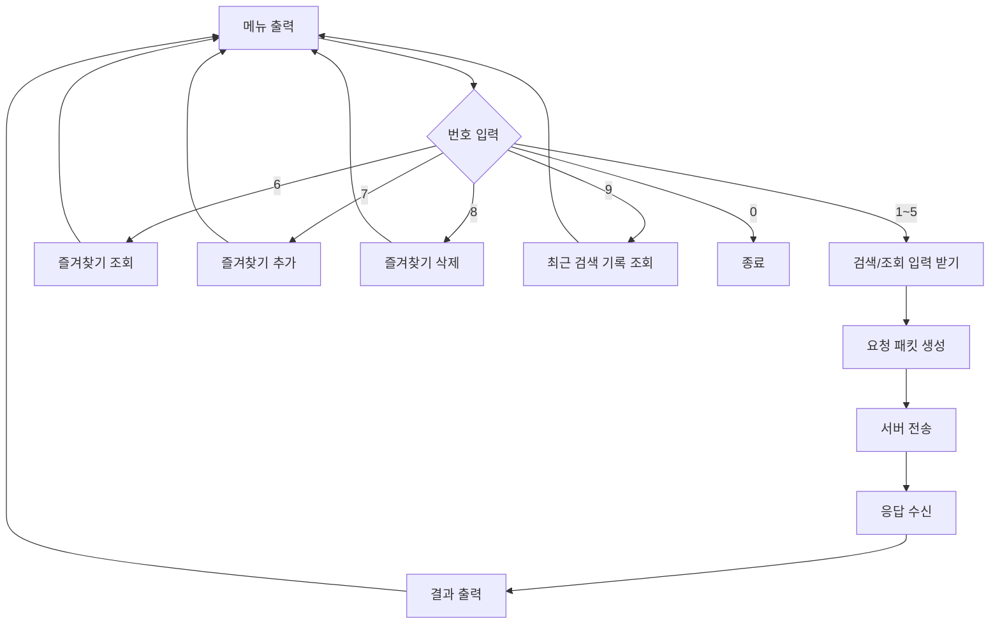

# 클라이언트 구성 요소

## 1. 컴포넌트 목록

| 컴포넌트 | 주요 파일 | 책임 |
|----------|-----------|------|
| Client Main | `src/client/main.c` | 서버 접속 정보 입력, 메뉴 루프 시작 |
| Menu | `src/client/menu.c/h` | 콘솔 메뉴 출력, 메뉴 번호 검증 |
| Client Net | `src/client/client_net.c/h` | TCP connect, send, recv |
| Request Builder | `src/client/request_builder.c/h` | 사용자 입력을 패킷 문자열로 변환 |
| Result Viewer | `src/client/result_viewer.c/h` | 서버 응답을 사용자 친화적으로 출력 |
| Favorite | `src/client/favorite.c/h` | 즐겨찾기 추가/조회/삭제/중복 검사 |
| Recent Search | `src/client/recent_search.c/h` | 최근 검색 기록 저장/조회 |

## 2. 메뉴 처리 흐름

## 3. 로컬 파일 책임

| 파일 | 처리 위치 | 비고 |
|------|-----------|------|
| `client_data/favorites.txt` | 클라이언트 | 서버에 전송하지 않는 로컬 편의 기능 |
| `client_data/recent_search.txt` | 클라이언트 | 검색 요청 전후에 기록 |

즐겨찾기와 최근 검색 기록은 서버 세션과 독립적으로 동작한다.
