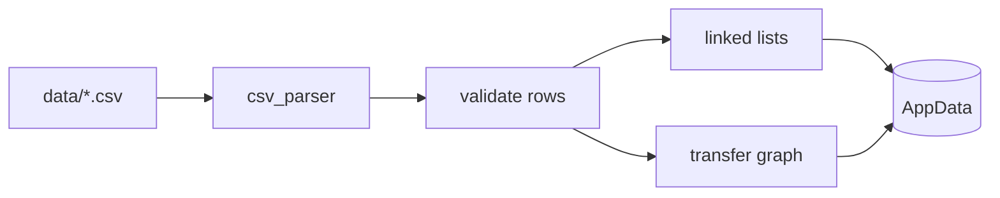
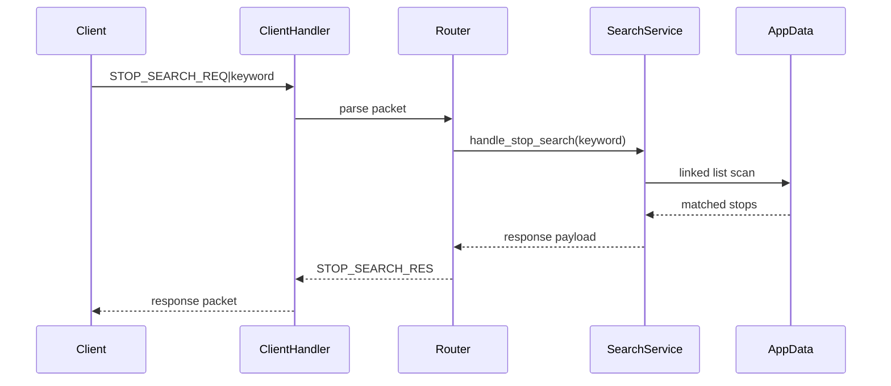
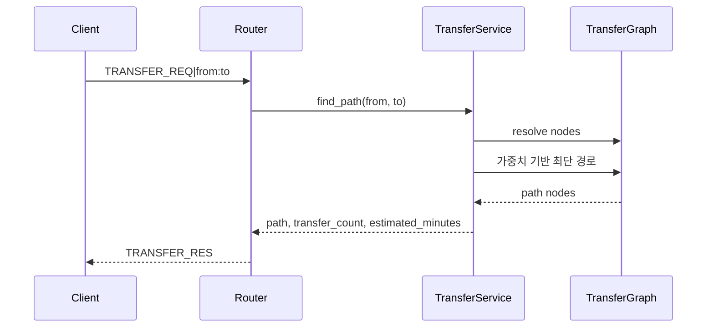

# 데이터 흐름

## 1. 서버 시작 데이터 로딩

서버는 listen을 시작하기 전에 필수 CSV를 로드한다. 로딩된 데이터는 요청 처리 중
읽기 중심으로 사용한다.

## 2. 검색 요청 흐름

## 3. 환승 요청 흐름

## 4. 파일 저장 흐름

| 기능 | 흐름 |
|------|------|
| 서버 로그 | 요청 수신 -> 처리 결과 생성 -> `log_info()` -> `logs/server.log` |
| 즐겨찾기 | 메뉴 7번 -> 기존 파일 읽기 -> 중복 검사 -> `favorites.txt` append |
| 최근 검색 | 검색 입력 완료 -> `recent_search.txt` append -> 검색 요청 전송 |
