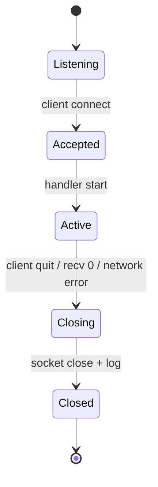

# 세션 생명주기

## 1. 서버 세션

## 2. 클라이언트 생명주기

1. 프로그램 실행.
2. 서버 IP와 포트 입력.
3. TCP 연결 시도.
4. 연결 성공 후 `HELLO` 또는 첫 메뉴 요청 전송.
5. 메뉴 루프에서 요청/응답 반복.
6. 0번 종료 또는 연결 실패 시 소켓 종료.

## 3. 종료 처리 규칙

| 상황 | 서버 처리 | 클라이언트 처리 |
|------|-----------|----------------|
| 정상 종료 | 세션 비활성화, 소켓 close, 로그 기록 | 종료 요청 또는 소켓 close |
| recv 0 | 연결 종료로 판단 | 해당 없음 |
| 패킷 파싱 실패 | `INVALID_REQUEST` 또는 연결 유지 | 오류 메시지 출력 |
| 네트워크 오류 | 세션 정리, 오류 로그 | 재시도 안내 또는 종료 |

