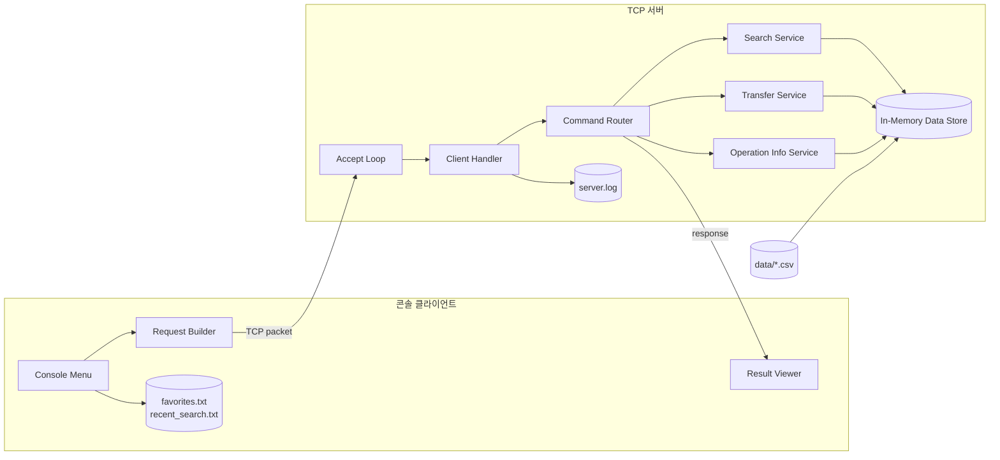

# 시스템 컨텍스트

## 1. 배치도

## 2. 주요 구성 요소

| 요소 | 책임 |
|------|------|
| `transit_server` | TCP listen, 클라이언트 요청 수신, CSV 로딩, 검색/환승/운행 정보 응답 |
| `transit_client` | 콘솔 메뉴 출력, 사용자 입력 검증, 요청 패킷 생성, 응답 출력 |
| `data/*.csv` | 정류장, 노선, 지하철역, 편의시설, 테스트 운행 데이터 |
| `client_data/*.txt` | 즐겨찾기, 최근 검색 기록 |
| `logs/server.log` | 접속, 요청, 처리 결과, 오류 로그 |

## 3. 외부 의존성

| 의존성 | 용도 |
|--------|------|
| C11 표준 라이브러리 | 문자열, 파일 입출력, 메모리 관리 |
| POSIX socket / Winsock | TCP 통신 |
| pthread 또는 플랫폼 스레드 | 다중 클라이언트 처리 |

서버는 인터넷이나 외부 실시간 교통 API를 호출하지 않는다.

