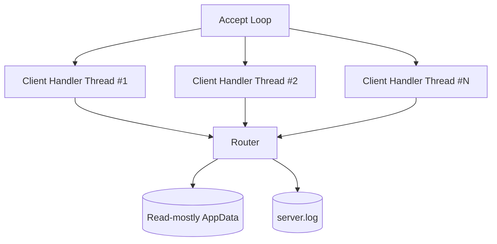

# 스레딩 모델

## 1. 기본 모델

서버는 thread-per-client 모델을 기본으로 한다.

## 2. 공유 자원

| 자원 | 위험 | 보호 방식 |
|------|------|-----------|
| `AppData` | 로딩 후 읽기 중심이므로 낮음 | 서버 시작 후 변경하지 않음 |
| `ClientSession[]` | 접속/종료 동시 갱신 | mutex |
| `logs/server.log` | 로그 라인 섞임 | mutex 또는 단일 로그 함수 |
| 동적 메모리 | 해제 누락 | 종료 시 리스트/그래프 일괄 해제 |

## 3. 클라이언트

콘솔 클라이언트는 단일 스레드 요청/응답 모델을 기본으로 한다.
한 번에 하나의 메뉴 작업을 처리하므로 UI 동시성은 필요하지 않다.

