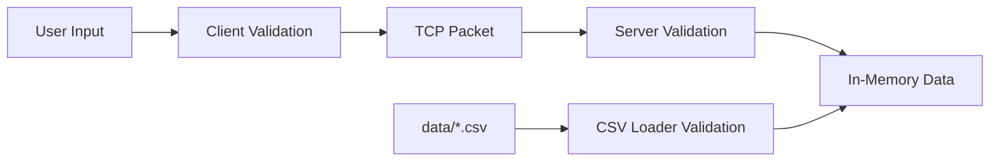

# 위협 모델

## 1. 주요 위협

| 위협 | 영향 | 대응 |
|------|------|------|
| 과도하게 긴 패킷 | 버퍼 오버플로 또는 메모리 낭비 | `MAX_PACKET_SIZE` 검사 |
| 잘못된 CSV | 검색 오류, NULL 접근 | 로딩 단계 검증 |
| 구분자 삽입 | 패킷 파싱 오류 | 입력 문자 제한 |
| 로그 개행 삽입 | 로그 위조 | 개행 제거 후 기록 |
| 클라이언트 비정상 종료 | 세션 누수 | recv 실패 처리 및 소켓 close |
| 동시 로그 쓰기 | 로그 라인 섞임 | mutex 또는 단일 로그 함수 |
| 파일 누락 | 기능 실패 | 시작 시 확인, 명확한 오류 |

## 2. 신뢰 경계

사용자 입력, 네트워크 패킷, CSV 파일은 모두 신뢰하지 않고 검증한다.

## 3. 비목표

- TLS 암호화.
- 사용자 인증.
- 인터넷 공개 서비스 수준의 보안.
- 개인정보 저장 및 보호 체계.

