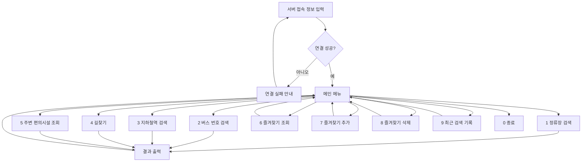

# 화면 흐름

```mermaid
flowchart TD
    A[서버 접속 정보 입력] --> B{연결 성공?}
    B -->|아니오| C[연결 실패 안내]
    C --> A
    B -->|예| D[메인 메뉴]
    D --> E[1 정류장 검색]
    D --> F[2 버스 번호 검색]
    D --> G[3 지하철역 검색]
    D --> H[4 길찾기]
    D --> I[5 주변 편의시설 조회]
    D --> J[6 즐겨찾기 조회]
    D --> K[7 즐겨찾기 추가]
    D --> L[8 즐겨찾기 삭제]
    D --> N[9 최근 검색 기록]
    D --> M[0 종료]
    E --> R[결과 출력]
    F --> R
    G --> R
    H --> R
    I --> R
    J --> D
    K --> D
    L --> D
    N --> D
    R --> D
```

## 원칙

- 모든 기능은 작업 완료 후 메인 메뉴로 복귀한다.
- 서버 연결이 끊긴 경우 사용자에게 안내하고 종료 또는 재접속을 선택하게 한다.
- 입력값이 잘못되면 서버 요청 전 클라이언트에서 먼저 안내한다.
