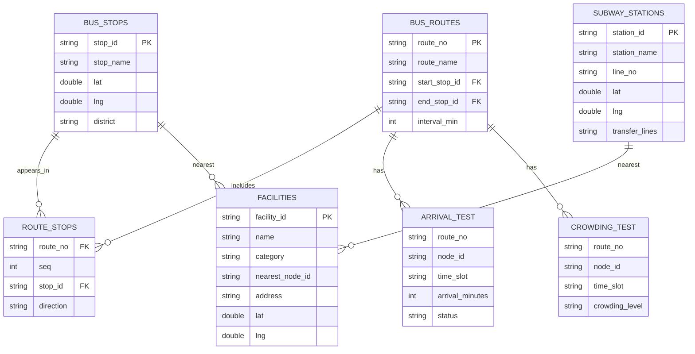

# 파일 관계도

## 관계 해석

- `route_stops.route_no`는 `bus_routes.route_no`를 참조한다.
- `route_stops.stop_id`는 `bus_stops.stop_id`를 참조한다.
- `facilities.nearest_node_id`는 정류장 ID 또는 지하철역 ID를 가질 수 있다.
- `arrival_test.node_id`, `crowding_test.node_id`도 정류장 ID 또는 역 ID를 가질 수 있다.

