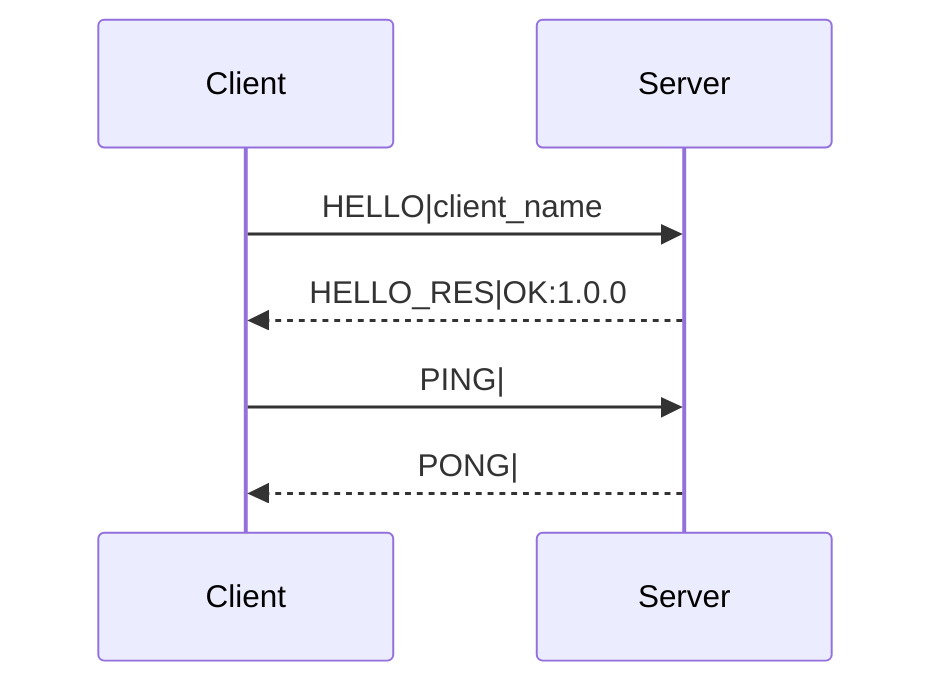
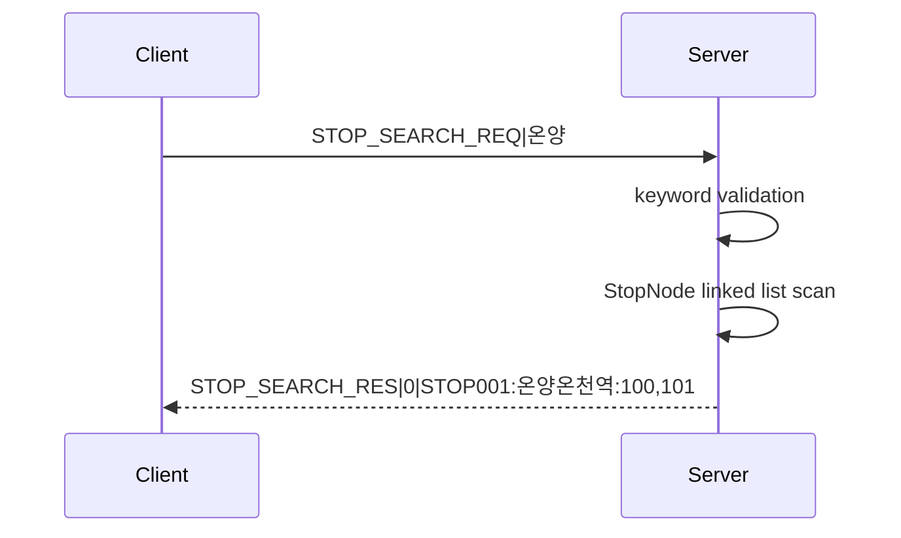
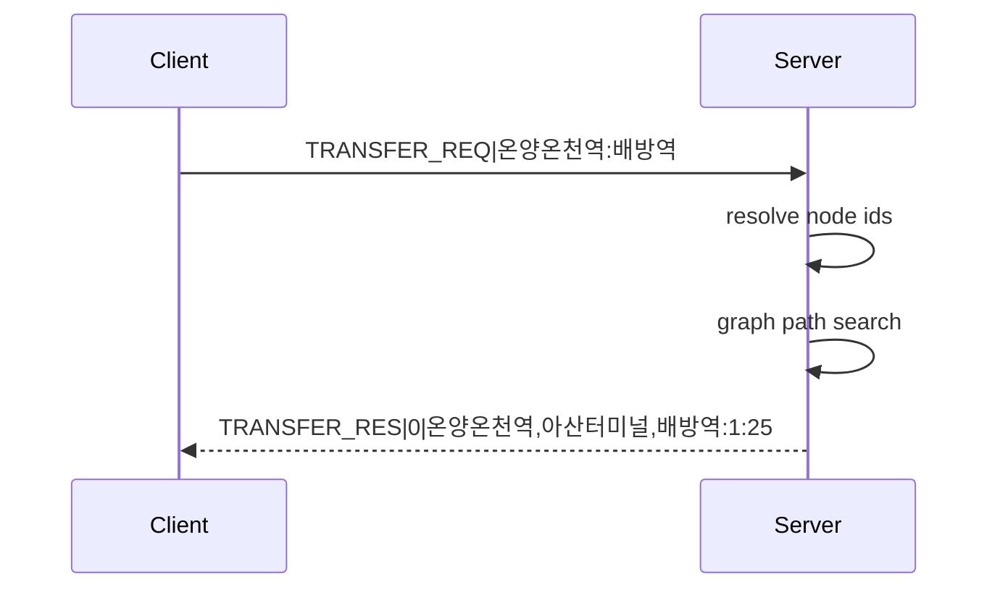
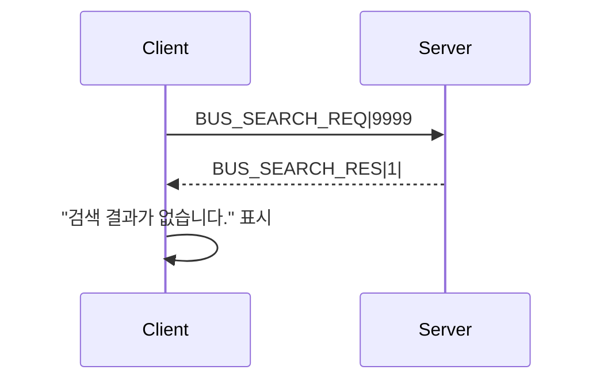

# 시퀀스 다이어그램

## 1. 연결 확인

```mermaid
sequenceDiagram
    participant C as Client
    participant S as Server

    C->>S: HELLO|client_name
    S-->>C: HELLO_RES|OK:1.0.0
    C->>S: PING|
    S-->>C: PONG|
```

## 2. 정류장 검색

```mermaid
sequenceDiagram
    participant C as Client
    participant S as Server

    C->>S: STOP_SEARCH_REQ|온양
    S->>S: keyword validation
    S->>S: StopNode linked list scan
    S-->>C: STOP_SEARCH_RES|0|STOP001:온양온천역:100,101
```

## 3. 환승 조회

```mermaid
sequenceDiagram
    participant C as Client
    participant S as Server

    C->>S: TRANSFER_REQ|온양온천역:배방역
    S->>S: resolve node ids
    S->>S: graph path search
    S-->>C: TRANSFER_RES|0|온양온천역,아산터미널,배방역:1:25
```

## 4. 결과 없음

```mermaid
sequenceDiagram
    participant C as Client
    participant S as Server

    C->>S: BUS_SEARCH_REQ|9999
    S-->>C: BUS_SEARCH_RES|1|
    C->>C: "검색 결과가 없습니다." 표시
```

